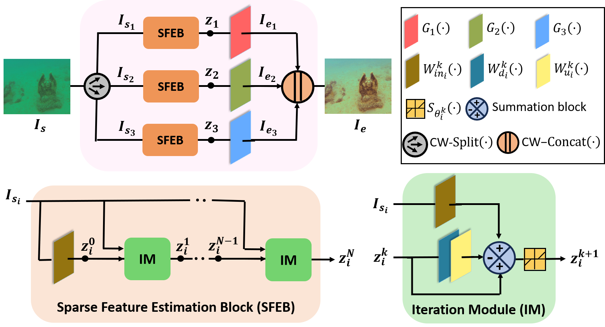

# SINET: Sparsity-driven Interpretable Neural Network for Underwater Image Enhancement

[arxiv](https://arxiv.org/pdf/2409.09021)

> **Abstract:** *Improving the quality of underwater images is essential for advancing marine research and technology. This work introduces a sparsity-driven interpretable neural network (SINET) for the underwater image enhancement (UIE) task. Unlike pure deep learning methods, our network architecture is based on a novel channel-specific convolutional sparse coding (CCSC) model, ensuring good interpretability of the underlying image enhancement process. The key feature of SINET is that it estimates the salient features from the three color channels using three sparse feature estimation blocks (SFEBs). The architecture of SFEB is designed by unrolling an iterative algorithm for solving the ℓ<sub>1 regulaized convolutional sparse coding (CSC) problem. Our experiments show that SINET surpasses state-of-the-art PSNR value by 1.05 dB with  3873 times lower computational complexity.* 




## Dependencies
- Python 3.9
- PyTorch 2.0.1
- [NVIDIA GPU + CUDA](https://developer.nvidia.com/cuda-downloads)

## Create environment and install packages
```
conda create -n INNPAR python=3.9
conda activate INNPAR
pip install -r requirements.txt
```

## Contents
1. [Datasets](#Datasets)
2. [Pretrained](#Pretrained)
3. [Training](#Training)
4. [Testing](#Testing)
5. [Citation](#Citation)

## Datasets

Used training and testing sets can be downloaded as follows:

[Trainset](https://li-chongyi.github.io/proj_benchmark.html) (UIEB dataset)

[Testset](https://drive.google.com/drive/folders/12U-OpP1fzPj4LB59EhiiowYT9QlMlsG-?usp=sharing) (LSUI, UIEBC)

Download training and test sets and keep them into the corresponding folders of `datasets/`. See [datasets](datasets/README.md) for the detail of the directory structure.

## Pretrained

Pre-trained network parameters can be downloaded from:

[pretrained](https://drive.google.com/drive/folders/1JvhXdhIALnmrLM9vPko-pvHQ8TufdvKi?usp=sharing)

Download pretrained weights and keep into the `checkpoints/` folder.

## Training

- Download [trainset](https://li-chongyi.github.io/proj_benchmark.html) (UIEB dataset), place in `datasets/` folder.

- Run the following script.

```
python train.py
```

## Testing

- Download the [pretrained](https://drive.google.com/drive/folders/1JvhXdhIALnmrLM9vPko-pvHQ8TufdvKi?usp=sharing) parameters and place in `checkpoints/` folder.

- Download [testset](https://drive.google.com/drive/folders/12U-OpP1fzPj4LB59EhiiowYT9QlMlsG-?usp=sharing) (LSUI, UIEBC), place them in `datasets/` folder.

- Run the following scripts.

- Test the PSNR, SSIM values on the LSUI test set
`python test_LSUI.py`
  
- Test the UIQM value on the UIEBC test set
`python test_UIEBC.py`


- The output images are in `results/`.
 
## Citation

If you find the code helpful in your research or work, please cite the following paper.

```
@article{panda2024sinet,
  title={SINET: Sparsity-driven Interpretable Neural Network for Underwater Image Enhancement},
  author={Panda, Gargi and Kundu, Soumitra and Bhattacharya, Saumik and Routray, Aurobinda},
  journal={arXiv preprint arXiv:2409.01022},
  year={2024}
}
```
